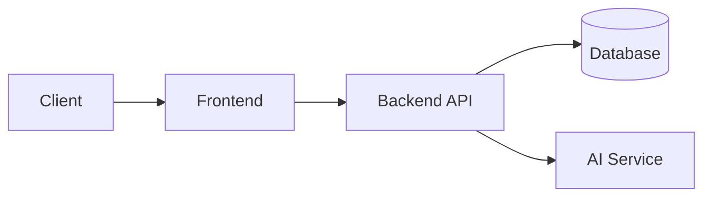

# [Project Name] by Xbyte

**Team:** Wong Wei Sheng, Yoo Jun Yang, Gerald Ho, Aidan Go Kun Zi

**Problem Statement:** [Stress & Workload Manager]

**Video Presentation:** [Unlisted YouTube Link]

**Presentation Slides:** [Public Link]

---

# 1. Project Overview

## The Problem

State the causes as you understand them, who the stakeholders are, and briefly mention what similar apps exist in the market (at least one) and why they fall short.

### Stakeholders
- [Stakeholder 1]
- [Stakeholder 2]
- [Stakeholder 3]

### Existing Solutions

| App | Why it falls short |
|------|--------------------|
| [App Name] | [Limitation] |
| [App Name] | [Limitation] |

## Our Solution

Describe your solution in **3–4 sentences**.

### Feature Set

- Feature 1
- Feature 2
- Feature 3
- Feature 4
- Feature 5

---

# 2. Ideation & Process

## 2.1 Ideas We Considered

| Idea | Why it was dropped / kept |
|------|----------------------------|
| **A (Chosen)** | [Reason] |
| **B (Chosen)** | [Reason] |
| C | [Reason] |
| D | [Reason] |

## 2.2 Ideation Boards

Embed images directly or provide links to your ideation boards.

### Mindmap

*Briefly explain what this diagram shows.*

### User Flow

*Briefly explain the interaction flow.*

### Crazy Eights

*Briefly explain how these sketches influenced the final design.*

---

## 2.3 Mentor Consultation

| Date | Mentor | Feedback Received | What Was Changed |
|------|--------|-------------------|------------------|
| DD/MM/YYYY | [Mentor] | [Feedback] | [Change made] |
| DD/MM/YYYY | [Mentor] | [Feedback] | [Change made] |

> Even if your team disagreed with a mentor's suggestion, explain your reasoning here.

---

# 3. Design & Prototype

**UI Prototype:** [Public Link]

Include **4–8 key screens** with captions explaining the interaction.

### Home Screen

*Shows today's tasks, workload score, and upcoming deadlines.*

### Mood Check-in

*Users record their daily stress level in under 30 seconds.*

### Smart Schedule

*AI generates a realistic daily timetable based on priorities.*

### Analytics

*Weekly productivity and wellbeing insights.*

---

# 4. What Makes It Different

List the novel features and explain what makes each unique.

| Feature | Originality / Twist |
|----------|---------------------|
| Feature 1 | [Explanation] |
| Feature 2 | [Explanation] |
| Feature 3 | [Explanation] |

### Optional Comparison

| Feature | Our App | Competitor |
|----------|---------|------------|
| AI Scheduling | ✅ | ❌ |
| Stress Tracking | ✅ | ❌ |
| Task Management | ✅ | ✅ |

---

# 5. Technical Architecture & Feasibility

## Tech Stack

| Layer | Technology | Why |
|--------|------------|-----|
| Frontend | [React / Flutter] | [Reason] |
| Backend | [Node.js / Express] | [Reason] |
| Database | [Supabase / Firebase] | [Reason] |
| AI / APIs | [OpenAI / Gemini] | [Reason] |
| Hosting | [Vercel / Render] | [Reason] |

### Constraints

- Constraint 1
- Constraint 2
- Constraint 3

## System Architecture Diagram *(Optional)*

Or use Mermaid:

## Build Plan & Scope

### MVP (What we will build)

- [ ] User authentication
- [ ] Core feature 1
- [ ] Core feature 2
- [ ] Core feature 3
- [ ] Analytics dashboard

### Stretch Goals

- [ ] Feature A
- [ ] Feature B
- [ ] Feature C
