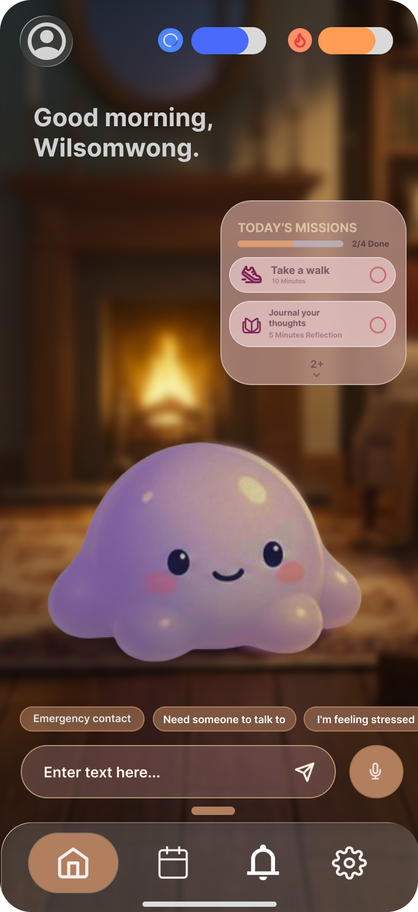
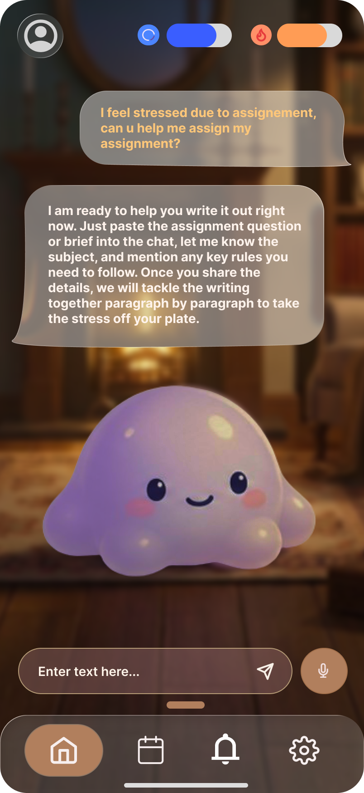
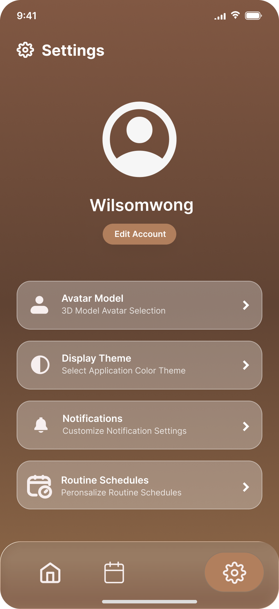
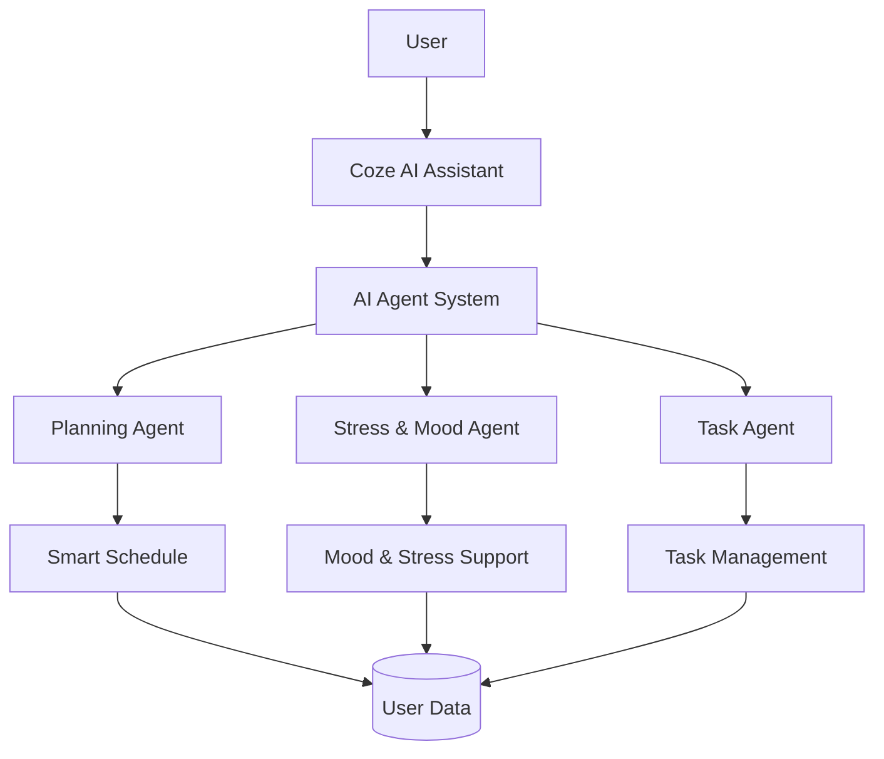
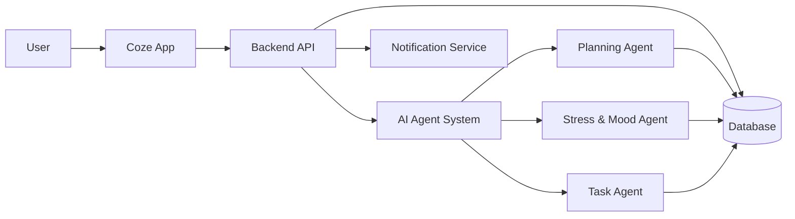

# Coze - AI Stress & Workload Manager

> **Coze is an AI-powered stress and workload management platform that helps users manage their tasks while taking their wellbeing into consideration.**

**Project by Xbyte**

### Team Members

- Wong Wei Sheng
- Yoo Jun Yang
- Gerald Ho
- Aidan Go Kun Zi

---

# 1. Project Overview

## The Problem

Students and young adults often need to manage assignments, deadlines, meetings, personal responsibilities, and other daily activities at the same time. When the workload becomes too high, users can feel stressed and overwhelmed, making it difficult to decide what they should focus on first.

Many existing productivity applications focus mainly on completing tasks and managing schedules. They usually do not consider the user's current mood or stress level when helping them plan their day.

### Stakeholders

- **Students** - Need to manage assignments, deadlines, classes, and personal activities while controlling their stress.
- **Young Working Adults** - Need to balance work responsibilities, meetings, deadlines, and personal time.
- **Busy Users** - Need help prioritising tasks and creating a realistic daily schedule.

### Existing Solutions

| App | Why it falls short |
|---|---|
| **Todoist** | Mainly focuses on task management and productivity. It does not strongly consider the user's emotional state when planning tasks. |
| **Google Calendar** | Good for scheduling events, but users still need to manually decide how to organise their tasks and workload. |
| **Finch** | Focuses more on wellbeing and self-care, but does not provide the same level of AI-based task planning and workload management. |

## Our Solution

**Coze** is an AI-powered stress and workload management platform designed to help users manage their tasks while taking their emotional state into consideration.

Users can talk to Coze about how they are feeling, record their mood, manage their tasks, and receive help from AI agents to organise their workload.

Instead of simply telling users to complete more tasks, Coze helps create a more realistic and balanced schedule based on their priorities and current situation.

### Feature Set

- 🤖 **AI Personal Assistant**
- 🧠 **Stress & Mood Support**
- 📋 **Smart Task Management**
- 📅 **AI Schedule Planning**
- 📊 **Workload & Wellbeing Tracking**
- 🔔 **Smart Notifications**
- 🐙 **Friendly AI Mascot**

The AI doesn't just schedule tasks. It understands the real-life context surrounding those tasks and adapts the user's schedule accordingly.

Context can include:

🕐 Time
📍 Location
🚗 Travel Time
📚 Task Priority
⏰ Deadline
🧠 Stress Level
⚡ Energy Level
😴 Sleep
💼 Work Commitments
👥 Social Events
🏃 Physical Activities
🛌 Recovery Time
⏳ Unexpected Events

This allows the AI to create a more realistic, flexible, and personalised schedule, rather than simply filling available time with tasks.

### Context-Aware Planning

The AI doesn't just schedule tasks. **It understands the context surrounding those tasks and uses that information to create a realistic and adaptable schedule.**

Context can include:

- 🕐 **Time**
- 📍 **Location**
- 🚗 **Travel Time**
- 📚 **Task Priority**
- ⏰ **Deadline**
- 🧠 **Stress Level**
- ⚡ **Energy Level**
- 😴 **Sleep**
- 💼 **Work Commitments**
- 👥 **Social Events**
- 🏃 **Physical Activities**
- 🛌 **Recovery Time**
- ⏳ **Unexpected Events**

### Adaptive Scheduling

When the user's situation changes, Coze can **re-evaluate and modify the schedule** instead of requiring the user to manually reorganise everything.

Coze can:

- Add newly created real-life events
- Consider location and estimated travel time
- Match tasks with the user's available energy
- Move lower-priority tasks when urgent work appears
- Protect recovery and rest time
- Recalculate workload when plans change
- Explain why a task was moved or rescheduled

### AI Schedule Explanation

Whenever Coze changes the user's schedule, the AI explains the reasoning behind the change.

For example:

> **"Your programming task was moved from 7:00 PM to 9:00 PM because your dinner event requires approximately 45 minutes of travel time, while the assignment deadline is tomorrow. Your lower-priority reading task was moved to tomorrow instead."**

This makes the AI's decisions more **transparent and trustworthy**.

### What-If Planning

Users can simulate a situation **before actually changing their schedule**.

Examples:

- *"What if I go for badminton tonight?"*
- *"What if I accept this dinner invitation?"*
- *"Can I finish this assignment if I work part-time tomorrow?"*
- *"What happens to my schedule if I add another 2-hour task?"*

Coze evaluates the consequences and shows possible scheduling options before the user commits to the change.

---

## Our Differentiator

### From AI Scheduling to Context-Aware Workload Management

Coze is **not just an AI calendar or task manager**.

It is a **context-aware workload manager that adapts to the user's real life**.

Traditional calendars answer:

> **"When is there free time?"**

AI planners answer:

> **"How should I arrange these tasks?"**

Coze aims to answer:

> **"Given everything happening in my life right now, what is the most realistic plan?"**

| Capability | Traditional Calendar | AI Planner | **Coze** |
|---|:---:|:---:|:---:|
| Task Management | ✅ | ✅ | ✅ |
| Calendar | ✅ | ✅ | ✅ |
| AI Planning | ❌ | ✅ | ✅ |
| Stress Awareness | ❌ | ⚠️ | **✅** |
| Energy Awareness | ❌ | ❌ | **✅** |
| Workload Capacity | ❌ | ⚠️ | **✅** |
| Dynamic Rescheduling | ❌ | ✅ | **✅** |
| Location Context | ❌ | ⚠️ | **✅** |
| Travel Consideration | ❌ | ⚠️ | **✅** |
| Unexpected Event Adaptation | ❌ | ⚠️ | **✅** |
| Recovery Planning | ❌ | ⚠️ | **✅** |
| What-If Planning | ❌ | ⚠️ | **✅** |
| Schedule Change Explanation | ❌ | ⚠️ | **✅** |

> **"Real life doesn't follow your calendar. Your calendar should adapt to real life."**

### Why Coze Is Different

Most productivity software treats the user's schedule as a **fixed structure** that the user must maintain.

Coze treats the schedule as a **dynamic plan** that can change when the user's circumstances change.

Instead of simply asking:

> **"Where can I put this task?"**

Coze considers:

> **"Can the user realistically handle this task at this time, given their workload, energy, stress, location, commitments, travel, and need for recovery?"**

---

## Real-Life Scenario

### Scenario: An Unexpected Dinner

Imagine a student already has a busy evening:

| Time | Existing Plan |
|---|---|
| 5:00 PM – 6:30 PM | Programming Assignment |
| 6:30 PM – 7:00 PM | Dinner |
| 7:00 PM – 9:00 PM | Group Project |
| 9:00 PM – 10:00 PM | Revision |
| 10:00 PM onwards | Rest |

The student suddenly receives an invitation:

> **"Let's have dinner together at 7:00 PM in Puchong."**

The student asks Coze:

> **"Can I go?"**

Instead of simply adding the event to the calendar, Coze evaluates the user's situation.

### What Coze Considers

**📍 Location**

The dinner is in Puchong while the user is currently elsewhere.

**🚗 Travel Time**

The journey requires additional travel time before and after the dinner.

**⏰ Deadlines**

The programming assignment is due soon and has a higher priority than revision.

**⚡ Energy**

The user has already had a long day and has limited energy remaining.

**🧠 Stress**

The user's current workload is already relatively high.

**🛌 Recovery**

Coze avoids filling every available hour and protects sufficient rest time.

### Coze's Response

Instead of simply rejecting the event or moving everything later, Coze can reorganise the workload:

- Keep the high-priority programming assignment
- Shorten or move the lower-priority revision session
- Add travel time before and after dinner
- Reschedule the group project if necessary
- Preserve recovery time
- Explain why each change was made

For example:

> **"You can attend the dinner, but your workload is already high. I moved your revision session to tomorrow because it has a lower priority and added travel time for the trip to Puchong. Your programming assignment remains tonight because its deadline is earlier. I also kept your usual recovery time."**

### What-If Scenario

Before accepting the dinner, the user can ask:

> **"What if I also go for badminton after dinner?"**

Coze simulates the additional activity and shows the impact.

| Option | Workload | Assignment | Recovery |
|---|---|---|---|
| **Dinner only** | Manageable | Completed | Preserved |
| **Dinner + Badminton** | High | Must be shortened or moved | Reduced |

The user can then make the final decision.

> **Coze doesn't decide how the user should live. It helps the user understand the consequences of their choices.**
---

# 2. Ideation & Process

## 2.1 Ideas We Considered

| Idea | Decision | Reason |
|---|:---:|---|
| **Coze - AI Stress & Workload Manager** | ✅ Chosen | Combines productivity, stress management, and AI planning in one platform. |
| Normal To-Do List | ❌ Dropped | Too similar to existing productivity applications. |
| AI Mental Health Chatbot | ❌ Dropped | Focuses mainly on conversation and does not solve workload management. |
| AI Calendar Planner | ❌ Dropped | Focuses mainly on scheduling and does not consider stress and wellbeing. |

### Why We Chose Coze

We wanted to create an application that connects **wellbeing and productivity** instead of treating them as two separate problems.

Our idea is that effective productivity should not only be about completing more tasks. It should also help users understand their workload and avoid unnecessary stress.

---

## 2.2 Ideation Boards

### Mindmap


The mindmap shows the main problems we identified around **stress, workload, time management, and productivity**. We then connected these problems to possible solutions such as AI assistance, mood tracking, task management, scheduling, and notifications.

### User Flow


The user flow shows how users interact with Coze from the beginning of their day. Users can check their current tasks and schedule, communicate with the AI assistant, update their mood, manage tasks, and receive suggestions for planning their day.

### Crazy Eights


The Crazy Eights activity helped us quickly explore different interface ideas. We experimented with different layouts for the AI assistant, task list, calendar, mood tracking, and mascot interaction.

These sketches helped us decide on a simple interface that keeps the AI assistant and daily tasks easy to access.

---

## 2.3 Mentor Consultation

| Date | Mentor | Feedback Received | What Was Changed |
|---|---|---|---|
| DD/MM/YYYY | Mentor Name | The application should clearly explain how AI helps users instead of only acting as a chatbot. | Added AI-based task planning and schedule generation. |
| DD/MM/YYYY | Mentor Name | The interface should be simple and friendly because users may already feel stressed. | Simplified the interface and introduced the Coze mascot. |
| DD/MM/YYYY | Mentor Name | The application should show the user's tasks and schedule clearly. | Added Calendar/List views and Today's Missions section. |

---

# 3. Design & Prototype

**UI Prototype:** [Prototype Link]

Our prototype focuses on creating a **friendly, simple, and low-pressure experience**.

Instead of using a typical productivity-app design, Coze uses a soft visual style and a cute mascot to make users feel more comfortable when interacting with the application.

## Home Screen



The Home Screen gives users a quick overview of their day.

It includes:

- Today's missions
- Important tasks
- Upcoming activities
- AI assistant
- Quick access to the main application functions

---

## AI Assistant



The AI Assistant allows users to communicate naturally with Coze.

Users can:

- Explain how they are feeling
- Ask for help with their workload
- Ask how to organise their tasks
- Request help planning their day
- Talk about problems affecting their productivity

---

## Smart Schedule


The Smart Schedule provides a clear overview of the user's planned activities.

Tasks can be organised into different periods of the day, helping users understand what they should focus on instead of thinking about their entire workload at once.

---

## Calendar & List View


Users can switch between calendar and list views.

The **Calendar View** provides a quick overview of the user's schedule, while the **List View** provides more detailed information about individual tasks and activities.

---

## Today's Missions


Today's Missions shows the tasks that need the user's attention.

Tasks can be given different priorities so users can focus on important work first.

---

## Settings



The Settings page allows users to customise their Coze experience.

Users can manage:

- Account information
- AI avatar
- Display theme
- Notifications
- Routine schedules

---

# 4. What Makes It Different

Coze is not designed to be another simple task management application.

Its main difference is the combination of **AI planning and wellbeing support**.

| Feature | Coze | Traditional To-Do App |
|---|:---:|:---:|
| Task Management | ✅ | ✅ |
| Calendar | ✅ | ✅ |
| AI Assistant | ✅ | ⚠️ |
| AI Task Planning | ✅ | ❌ |
| Stress Tracking | ✅ | ❌ |
| Mood Tracking | ✅ | ❌ |
| Workload Management | ✅ | ⚠️ |
| AI Stress Support | ✅ | ❌ |
| Friendly AI Companion | ✅ | ❌ |

### Our Main Idea

> **"Coze doesn't just manage your tasks. It helps you manage yourself while completing them."**

---

# 5. AI Agent System

One of the main concepts behind Coze is the use of multiple AI agents instead of using AI only as a normal chatbot.



## Planning Agent

The **Planning Agent** helps users organise their tasks and create a realistic schedule based on priorities and available time.

## Stress & Mood Agent

The **Stress & Mood Agent** responds to the user's current situation and provides general supportive suggestions when the user feels stressed or overwhelmed.

## Task Agent

The **Task Agent** helps users create, update, prioritise, and complete missions.

---

# 6. Technical Architecture



## Tech Stack

| Layer | Technology | Purpose |
|---|---|---|
| Frontend | React / React Native | User interface and interaction |
| Backend | Node.js / Express | API and application logic |
| Database | Supabase / Firebase | User, task, schedule, and mood data |
| AI | OpenAI / Gemini API | AI agents and planning |
| Hosting | Vercel / Render | Application deployment |

> **Note:** Replace the technologies above with the actual technologies used in the project.

---

# 7. Privacy & Safety

Coze is designed as a general wellbeing and productivity application.

The AI provides general support and planning suggestions. It is **not intended to replace professional mental health care, diagnosis, or treatment**.

Important user information should be handled securely, and users should remain in control of their tasks and schedules.

---

# 8. Constraints

During development, we identified several constraints:

- AI responses may not always be completely accurate.
- AI API usage can introduce cost and response-time limitations.
- User data needs to be handled carefully.
- The AI should not be presented as a replacement for professional mental health support.
- The project has limited development time, so some advanced AI features may need to be simplified.

---

# 9. Build Plan & Scope

## MVP

- [ ] User authentication
- [ ] User profile
- [ ] Coze AI Assistant
- [ ] Task / Mission management
- [ ] Calendar
- [ ] Daily schedule
- [ ] Mood / stress check-in
- [ ] AI-assisted task planning
- [ ] Notifications
- [ ] Settings and theme customisation

## Stretch Goals

- [ ] More specialised AI agents
- [ ] Automatic task prioritisation
- [ ] AI-generated daily plans
- [ ] Weekly stress and productivity analysis
- [ ] Smart notification timing
- [ ] Voice interaction
- [ ] External calendar integration
- [ ] Personalised recommendations based on long-term user patterns

---

# 10. Team

| Member | Role |
|---|---|
| **Wong Wei Sheng** | Team Lead |
| **Yoo Jun Yang** | Team Member |
| **Gerald Ho** | Team Member |
| **Aidan Go Kun Zi** | Team Member |

---

# 11. Project Links

- 🎥 **Video Presentation:** [Unlisted YouTube Link]
- 🎨 **UI Prototype:** [Prototype Link](https://www.figma.com/design/d2CJwlIP6BHQUiMtMa1pkO/XByte-Codenation-Hackathon?node-id=0-1&t=G0hEf5GM1Nn3rjXc-1)
- 📊 **Presentation Slides:** [Public Slides Link]

---

# 12. Project Structure

```text
Coze/
├── README.md
├── docs/
│   ├── images/
│   │   ├── mindmap.png
│   │   ├── userflow.png
│   │   └── crazy8.png
│   │
│   └── screenshots/
│       ├── home.png
│       ├── assistant.png
│       ├── schedule.png
│       ├── calendar.png
│       ├── missions.png
│       └── settings.png
│
└── src/
    └── ...
```

---

# ❤️ Our Goal

We want Coze to make productivity feel **less stressful and more manageable**.

Instead of forcing users to work harder, Coze helps users understand their workload, organise their priorities, and take care of themselves along the way.

> **Coze — Plan better. Stress less.**
